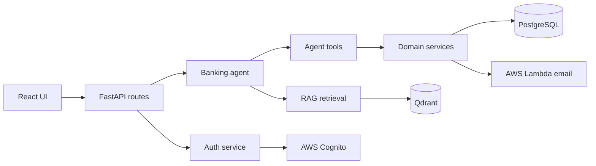

# Architecture

Kama Banking Chatbot is organized as a small FastAPI service with a separate Vite/React frontend source tree. The production backend serves the built frontend from `app/static/chatbot`.

## Backend Layers

- `app/api` contains HTTP-facing routes for chat and profile access.
- `app/auth` contains signup, login, token validation, Cognito validation, and PostgreSQL-backed JWT auth.
- `app/agents` builds the LangChain banking assistant and wires allowed tools into the model.
- `app/tools` adapts service functions into LangChain tools scoped to the authenticated user.
- `app/services` contains business logic for accounts, cards, support requests, and cache policy.
- `app/models` contains SQLAlchemy ORM models.
- `app/core` contains shared infrastructure: configuration, database sessions, AWS clients, Qdrant client, LLM setup, and error constants.

## Data Flow

1. The user signs up or logs in through `/auth`.
2. Authenticated chat requests reach `/chat` with a bearer token.
3. The route creates a user-scoped banking agent and passes recent conversation context.
4. The agent calls backend tools only when needed.
5. Tools execute business logic through services and SQLAlchemy sessions.
6. General banking questions use RAG over Qdrant-backed document chunks.
7. Cacheable general responses can be stored in PostgreSQL and optionally Qdrant semantic cache.

## Persistence

PostgreSQL stores users, accounts, cards, support requests, and exact chat cache entries. SQL migrations live in `app/core/db/migrations`, and `python -m app.core.db.run_migrations` applies unapplied migrations.

Qdrant stores RAG document vectors and optional semantic chat cache vectors. PDF source documents are currently kept under `app/rag/pdfs`.

## Configuration

Configuration is centralized in `app/core/config.py` and read from environment variables. The application validates required database, LLM, auth, and Qdrant settings at startup. `.env.example` documents safe placeholder values.
