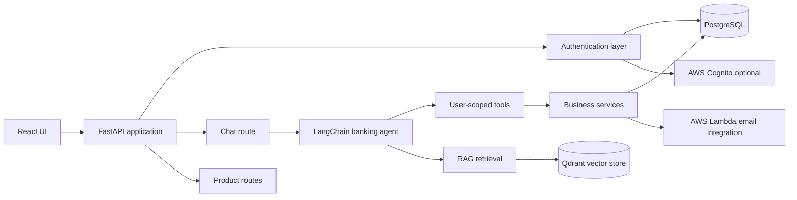

# Architecture

This document describes the runtime architecture and module boundaries of Kama Banking Chatbot.

## System Context

Kama Banking Chatbot is a full-stack web application. The backend is a FastAPI service that exposes authentication, profile, product, and chat endpoints. The frontend is a Vite/React application that is built into static assets and served by FastAPI from `app/static/chatbot`.

The assistant uses a LangChain agent backed by Anthropic Claude. The agent can answer general banking questions through retrieval-augmented generation and can perform user-scoped banking actions through explicit backend tools.



## Runtime Responsibilities

| Layer | Location | Responsibility |
| --- | --- | --- |
| HTTP API | `app/api`, `app/auth`, `app/product` | FastAPI routes, request validation, dependency injection |
| Agent assembly | `app/agents` | Creates the banking assistant and registers allowed tools |
| Tool adapters | `app/tools` | Converts service functions into LangChain tools scoped to the authenticated user |
| Business services | `app/services` | Banking product logic, support request logic, chat cache policy |
| Persistence models | `app/models` | SQLAlchemy ORM models for users, accounts, cards, support requests, and cache entries |
| Infrastructure | `app/core` | Configuration, database sessions, migrations, AWS clients, Qdrant client, LLM setup |
| Retrieval | `app/rag` | PDF extraction, chunking, embedding, vector retrieval |
| Frontend | `frontend` | React source application |
| Static UI | `app/static/chatbot` | Built frontend served by FastAPI |

## Request Flow

### Authentication

1. A user registers through `/auth/signup`.
2. In local mode, credentials are stored in PostgreSQL with a PBKDF2 password hash.
3. In AWS mode, signup and login are delegated to AWS Cognito.
4. Authenticated requests use bearer tokens.
5. The auth layer resolves the current user before protected routes execute.

### Chat

1. The frontend sends an authenticated request to `/chat`.
2. The route checks whether the prompt is eligible for exact or semantic cache lookup.
3. If no cached answer exists, the route creates a user-scoped banking agent.
4. The agent decides whether to answer directly, use RAG, or call a banking tool.
5. Banking tools execute service logic with the authenticated user's ID and active database session.
6. Safe, name-stripped responses are returned and eligible responses are cached.

### RAG

1. Banking PDFs live under `app/rag/pdfs`.
2. Ingestion reads PDFs, chunks content, embeds chunks, and stores vectors in Qdrant.
3. General banking questions can call the `rag_search` tool.
4. Retrieved context is passed back to the agent for final answer generation.

## Persistence

PostgreSQL stores:

- users and password hashes
- bank accounts
- bank cards
- support requests
- exact chat cache entries

SQL migration files live in `app/core/db/migrations`. Run migrations with:

```bash
python -m app.core.db.run_migrations
```

Qdrant stores:

- document vectors for retrieval
- optional semantic chat cache vectors

## Configuration Design

Configuration is centralized in `app/core/config.py` and loaded from environment variables. The application validates required values during startup. This keeps secrets out of source code and avoids scattered `os.getenv()` calls in business logic.

Key configuration groups:

- database connection
- authentication provider
- Anthropic model credentials
- Qdrant connection
- cache settings
- AWS and email integration settings

## Security Boundaries

- Protected endpoints depend on `get_current_user`.
- Agent tools receive the authenticated `user_id`; they do not accept arbitrary user IDs from chat input.
- The assistant prompt instructs the model not to reveal hidden instructions or sensitive backend details.
- Authorization and service-layer filtering remain the primary controls. Prompt instructions are defense-in-depth, not the security boundary.

## Architectural Decisions

- The project keeps a simple package layout under `app/` instead of introducing a deeper `src/` or enterprise architecture pattern.
- Agent tools are separated from business services so LangChain-specific code does not leak into core domain logic.
- Exact and semantic caching are restricted to prompts considered safe for reuse.
- Frontend source and backend-served build output are both kept because the backend serves the static UI directly.
